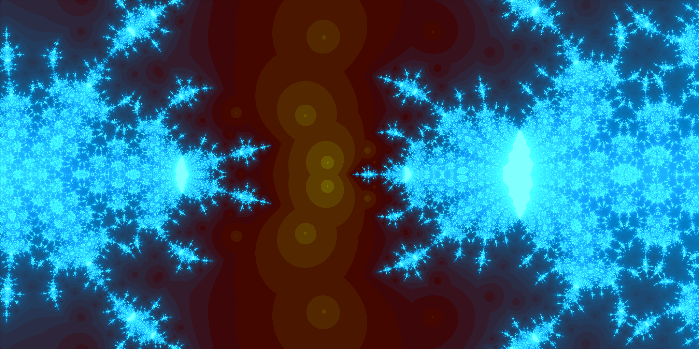
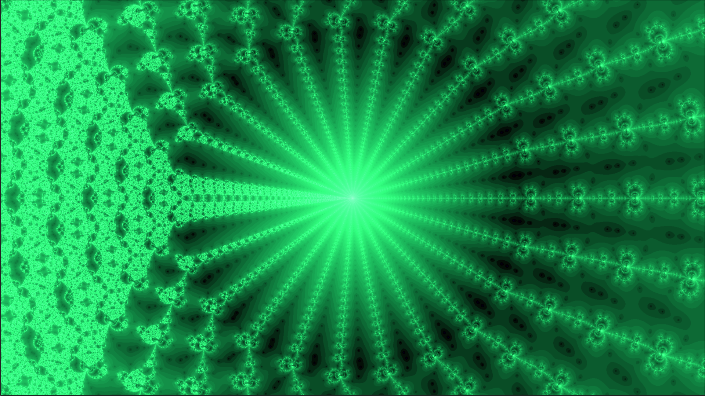
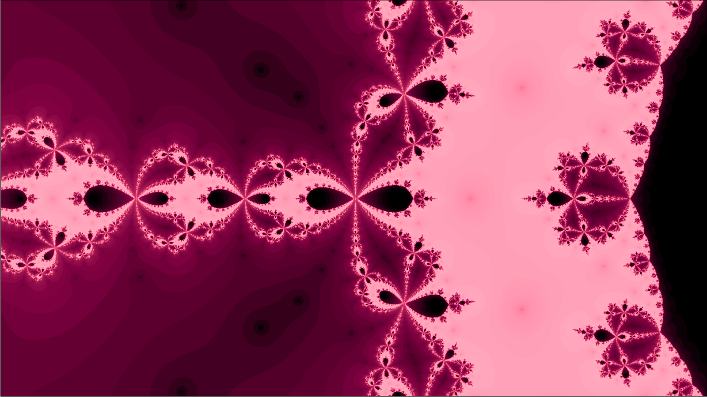
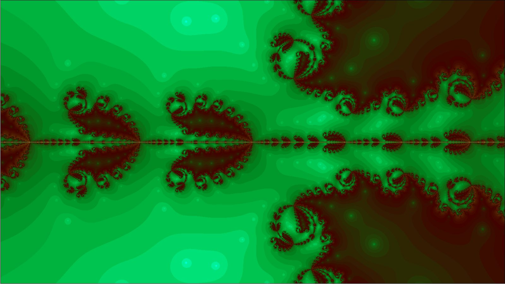

# CANF-gp

**C**UDA-**A**ccelerated-**N**ewton-**F**ractals with **g**nu**p**lot

A program for calculating Newton fractals on NVIDIA GPUs to be visualized with gnuplot on Linux machines. 

CPU-only mode is also available. 

For GPU mode a NVIDIA card of the Pascal generation (or newer) is required.

Tested on Ubuntu 19.10, GTX 1660 Ti with CUDA Toolkit 10.2.

## Features

* Fractals through root-finding of complex polynomials with rational, real exponents
* Iteration/basin-of-attraction based coloring
* Interactive zooming
* Random mode: Easily generate fractals never seen by anyone before 
* Fractional Riemann-Liouville derivative mode
* Create series of frames while zooming/adjusting the fractional derivative coefficient
* Significant speedup of calculations by using a GPU

## Examples


<p align="center">
  
</p>

<p align="center">
  
</p>


## Prerequisites

You need to have recent versions of the following programs:

```
g++
gnuplot 
make
boost 
nvcc (CUDA compiler, optional)
```

For installation of the boost library execute:

```
$ sudo apt install libboost-dev
```

## Compiling
First, clone (or simply download) and enter the repository:

```
$ git clone https://github.com/fhirschman/CANF-gp
$ cd CANF-gp
```

Check the makefile and adjust the specified 'CC' or 'NVCC' path if needed.

If you have a NVIDIA GPU with a working CUDA compiler (NVCC) enter:

```
$ make GPU
```
For a CPU-only compilation enter:

```
$ make CPU
```
A binary named 'fractal_[GPU/CPU]' will be compiled into the directory. 

## Running

To run on the GPU, simply enter:

```
$ ./fractal_GPU
```
or on the CPU:

```
$ ./fractal_CPU
```

A gnuplot window with a random fractal will open by default:

* If you click left within the windows a new random fractal will be calculated. If you see a black screen, just click left again a few times. Some random fractals just don't show convergence with the Newton method.

* If you click right, you activate the "zoom mode". By another right click you can select a region of the image to zoom into. Confirm this region with another right click. The roots in the selected complex region will be recalculated with full resolution. Repeat as pleased. You can also ctrl+mousewheel to zoom/unzoom or use the arrow keys to move around the complex plane. To exit "zoom mode", make a selection almost as big as the image itself. If you now click left, a new fractal will be generated, if you click right, "zoom mode" will be activated again.

* Have a look at "PARAMETERS.dat". There are many different possible settings, e.g. if you want to calculate a specific 
complex polynomial, change "MODE" to 0 and change "N_POLY_TERMS", "COEFFS" and "EXPONS" according to the desired polynomial. Different predefined color codes can be specified with the variable "COLOR CODE".

* If you want higher resolution pictures, adjust "N_X" and "N_Y", which specify the number of horizontal/vertical pixels. WARNING: Depending on the total number of pixels and the complexity/convergence behavior of the specified polynomial the calculation time can vary drastically. By using a GPU you can expect a speedup up to a factor of ~50.

There are many ways to generate pretty, unique fractals by altering the paramaters. Just play around with them!

## Literature

Newton fractals:

https://en.wikipedia.org/wiki/Newton_fractal

Fractals from fractional Riemann–Liouville/Caputo derivatives:

<a href="https://www.researchgate.net/publication/335702009_Visual_Analysis_of_the_Newton's_Method_with_Fractional_Order_Derivatives">Gdawiec et. al. 2019</a>

## Thanks to 

Dan Stahlke et. al for providing gnuplot-iostream:

https://github.com/dstahlke/gnuplot-iostream

## More examples








## Help pay my coffee bill
3MGf5jHST2CXbvYSCEM8utZjQaQx1kugAm
